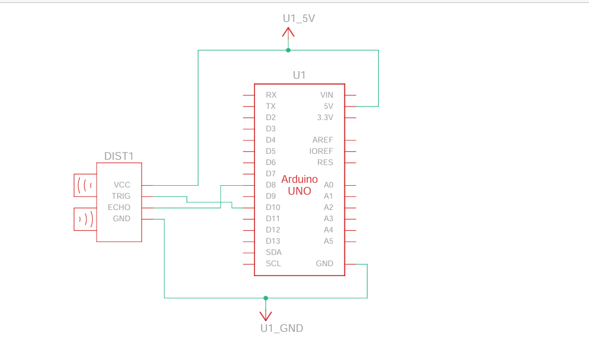

# Ultrasonic Distance Measurement using Arduino UNO

## Overview

This project implements a distance measurement system using an HC-SR04 ultrasonic sensor interfaced with an Arduino UNO. The system calculates the distance to an object by measuring the time taken for an ultrasonic pulse to travel to the object and reflect back.

---

## Objectives

* Measure distance using ultrasonic sensing
* Interface HC-SR04 with Arduino UNO
* Display real-time distance via Serial Monitor

---

## Components Used

* Arduino UNO
* HC-SR04 Ultrasonic Sensor
* Jumper wires
* USB cable

---

## Working Principle

The HC-SR04 sensor emits an ultrasonic pulse through the **TRIG** pin. When the wave hits an object, it reflects back and is received on the **ECHO** pin.

The time delay between transmission and reception is used to calculate distance:

Distance = (Time × Speed of Sound) / 2

* Speed of sound ≈ 343 m/s
* Division by 2 accounts for the round trip

---

## Circuit Diagram

---

## Pin Configuration

| Sensor Pin | Arduino Pin |
| ---------- | ----------- |
| VCC        | 5V          |
| GND        | GND         |
| TRIG       | D9          |
| ECHO       | D10         |

> Adjust pins if your code uses different ones.

---

## How It Works (Code Logic)

1. Set TRIG pin LOW initially
2. Send a 10µs HIGH pulse to TRIG
3. Measure duration of HIGH signal on ECHO
4. Convert time into distance
5. Print distance to Serial Monitor

---

## How to Run

1. Open the `.ino` file in Arduino IDE
2. Select board: **Arduino UNO**
3. Select correct COM port
4. Upload the code
5. Open Serial Monitor
6. Observe distance readings

---

## Output

* Distance displayed in centimeters (cm)
* Updates continuously in real time

---

## Limitations

* Accuracy affected by soft/angled surfaces
* Limited range (~2 cm to 400 cm)
* Sensitive to environmental noise

---

## Future Improvements

* Add LCD display for standalone output
* Integrate buzzer for obstacle alert
* Use servo motor for radar scanning
* Improve filtering for stable readings

---

## Author

Rithesh

---
